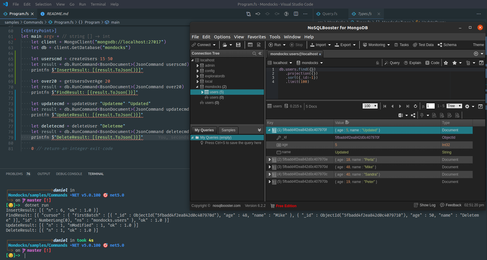

# Mondocks

A CE library to ease your work with mongodb from F#

> This library is based on the mongodb manual reference
> https://docs.mongodb.com/manual/reference/command/

the mongodb .NET driver is made entirely for C# and it expects you to pass data and information in a way C# can (reflection, inheritance among others) so I tried to go in a different way providing some helpers that allow more idiomatic F# code.

Commands are kind of a version of `raw sql queries` but they allow you to do what you already know how to do without much changes to the objects you might be manipulating already

## Sample Usage

Check out this quick sample of the work so far
```fsharp
open System
open Mondocks.Queries
open MongoDB.Driver
open MongoDB.Bson

let createUsers minAge maxAge = 
    let random  = Random()
    insert {
        use_collection "users"
        with_documents 
            [
                {| name = "Peter"; age = random.Next(minAge, maxAge); |}
                {| name = "Sandra"; age = random.Next(minAge, maxAge); |}
                {| name = "Mike"; age = random.Next(minAge, maxAge); |}
                {| name = "Perla"; age = random.Next(minAge, maxAge); |}
                {| name = "Updateme"; age = 1; |}
                {| name = "Deleteme"; age = 50; |}
            ]
    }

let updateUser (name: string) (newName: string) =
    update {
        use_collection "users"
        with_updates
            [
                { q = {| name = name |} 
                  u = {| name = newName; age = 5 |}
                  multi = Some false
                  upsert = Some false
                  collation = None 
                  arrayFilters = None
                  hint = None }
            ]
    }


let deleteUser (name: string) = 
    delete {
        use_collection "users"
        with_deletes [
            { q = {| name = name |}
              limit = 1
              collation = None
              hint = None
              comment = None }
        ]
    }

// Define a function to construct a message to print
let getUsersOverAge (age: int) =
    find {
        use_collection "users"
        with_filter {| age = {| ``$gt``= age |} |}
        with_limit 2
        with_skip 1
    }

[<EntryPoint>]
let main argv =
    let client = MongoClient("mongodb://localhost:27017")
    let db = client.GetDatabase("mondocks")

    let userscmd = createUsers 15 50
    let result = db.RunCommand<BsonDocument>(JsonCommand userscmd)
    printfn $"InsertResult: [{result.ToJson()}]"

    let over20 = getUsersOverAge 20
    let result = db.RunCommand<BsonDocument>(JsonCommand over20)
    printfn $"FindResult: [{result.ToJson()}]"

    let updatecmd = updateUser "Updateme" "Updated"
    let result = db.RunCommand<BsonDocument>(JsonCommand updatecmd)
    printfn $"UpdateResult: [{result.ToJson()}]"

    let deletecmd = deleteUser "Deleteme"
    let result = db.RunCommand<BsonDocument>(JsonCommand deletecmd)
    printfn $"DeleteResult: [{result.ToJson()}]"
    
    0 // return an integer exit code
```


# WIP

This is a work in progress, you can help providing feedback about it's usage

